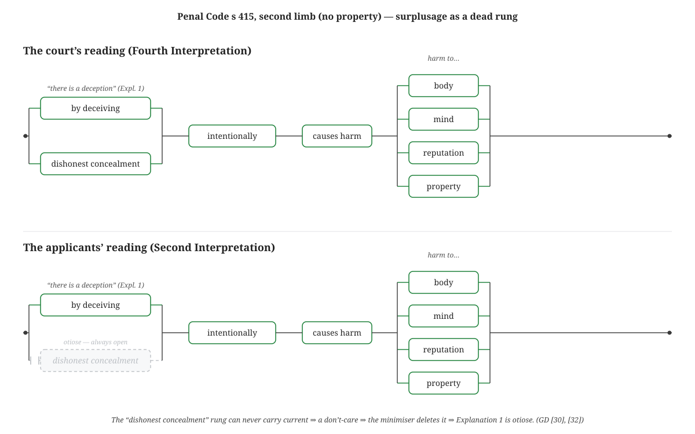

# The Letter and the Spirit

*How an exam-cheating case became a proof — and what that tells us about unifying law and computer science.*

---

## Our World in Black and White

Perhaps unfairly, it used to be said that "primitive tribes" knew few numbers: one, two, three, and many. In this chapter we go coarser still: we shall have zero, and everything else.

They say computers are made of ones and zeros. Fine: one is one. Two is one. Three is one. Sixteen billion and forty-two? Also one. Zero is zero.

Why a black-and-white world? For the same reason photographers choose it. Samuel Johnson said that when a man knows he is to be hanged in a fortnight, it concentrates his mind wonderfully. Reducing everything to binary, likewise. With ones and zeroes, arithmetic stops needing carries and times-tables: one plus two plus three is one; one times two times three is one. Anything times zero is zero. Anything plus one is one.

Now the trick: we use numbers to stand for truth. Lawyers find truth in words; here we find it in numbers. Let **one** mean **true** and **zero** mean **false**. Then we can use **addition for "or"** and **multiplication for "and"** (and ¬ for "not"). Mathematicians use `+` and `×` to calculate values; logicians use them to calculate truth.

> Parking is free on a Sunday or a public holiday.

"Or" is `+`:

```
FreeParking = Sunday + Holiday
```

If today is a Sunday and not a holiday — `Sunday = 1`, `Holiday = 0` — then `FreeParking = 1 + 0 = 1`. Yes, we park free. That is a legal rule in miniature, calculated by logic. Add a clause:

> Parking is free on a Sunday, or a public holiday, or after 8pm on a Saturday.

```
FreeParking = Sunday + Holiday + (AfterEight × Saturday)
```

`×` is "and"; the parentheses group, as in ordinary algebra. If `AfterEight × Saturday = 1`, the rest of the formula doesn't matter — anything plus one is one.

That is Boolean algebra, the foundation of computer science. Truth is number, and number truth.

## Three pictures of one thing

A formula has more than one face. You can write it as **algebra**: `Sunday + Holiday + (AfterEight × Saturday)`. You can draw it as a **picture** — a ladder of boxes, current flowing left to right, parallel rungs for "or," series for "and." (That is what the Layman tool draws, and what an electrician would call a circuit.) You can read it as a **sentence** of conjunctions and disjunctions.

Every formula can be drawn; every such picture can be written; both can be spoken. They are one object in three costumes — what a mathematician calls **isomorphic**.

That a formula and a circuit are the same object is no throwaway — it is a celebrated unification in its own right. In 1937 a twenty-one-year-old named Claude Shannon, in what is often called the most consequential master's thesis ever written, showed that the algebra of *and / or / not* is exactly the algebra of relays and switches: logic and circuitry are one thing. The relay "ladder" this essay draws later is his. (Shannon went on to found information theory; the better part of a century later, he lent his given name to an entire AI.) Keep that move in mind — taking two things long held apart and showing they are one — because it is the only move this essay makes.

What else is isomorphic to formulas and pictures?

Law.

This is not a new thought, and the credit is precise. The law-to-logic half of the bridge was built in 1957 by Layman E. Allen[^allen] — a law professor at Yale and later Michigan who, two years on, founded the discipline of *jurimetrics* and its journal under the American Bar Association — in a paper with the wonderful title *Symbolic Logic: A Razor-Edged Tool for Drafting and Interpreting Legal Documents*. A statute, Allen argued, has a logical skeleton — an arrangement of *and*, *or*, and *not* — and most legal ambiguity is not deep disagreement but mere sloppiness about that skeleton. He spent a career on it: "normalized" legal drafting, deontic logic for obligations and permissions, even a logic game, WFF 'N PROOF, to drill the structure into law students. Compose Allen's half-bridge with Shannon's, and a statute becomes a circuit.

Wrangle a law into Boolean logic and you can do new things — make predictions; predict whether a judge will buy an argument, or send someone to jail. The rest of this essay makes good on that claim, with a real case the Singapore Court of Appeal decided in 2022. It is a case about cheating. It will turn out to be a case about dead code.

---

## A real case: *Poh Yuan Nie*

In 2016, six students sat their 'O' Level examinations with help. At a tuition centre, accomplices registered as private candidates, live-streamed the questions out of the hall, and relayed answers back through hidden phones and earpieces. The scheme broke when an invigilator caught a student.

The principal, Poh Yuan Nie, and a teacher, Poh Min Fiona, were convicted of abetting cheating, and appealed to the top. They did not dispute the facts; they conceded that any reasonable person would call what they did dishonest. Their argument was narrower and stranger: that *as a matter of law*, what they did was **not cheating at all**.

Everything turned on one certified question (*Poh Yuan Nie v Public Prosecutor* [2022] SGCA 74, at [9]):

> … where the accused is charged with committing a "dishonest concealment of facts" within the meaning of Explanation 1 to [s 415], must the meaning of "dishonest" be determined with reference to the definition of "dishonestly" under s 24 of the Penal Code?

To see why a nation's highest court spent a judgment on the gap between an adjective and an adverb, read the statute as a programmer would: as code.

## The statute as code

Here is s 415 in full — one sentence, a hundred words, a single unbroken legal breath:

> Whoever, by deceiving any person, whether or not such deception was the sole or main inducement, fraudulently or dishonestly induces the person so deceived to deliver or cause the delivery of any property to any person, or to consent that any person shall retain any property, or intentionally induces the person so deceived to do or omit to do anything which he would not do or omit to do if he were not so deceived, and which act or omission causes or is likely to cause damage or harm to any person in body, mind, reputation or property, is said to “cheat”.

Reindented the way a modern drafter — or a programmer — would lay it out, its skeleton shows through (the **bold** terms are the operative atoms the code will turn into Booleans):

Whoever,  
&nbsp;&nbsp;&nbsp;&nbsp;(a) by **deceiving** any person,  
&nbsp;&nbsp;&nbsp;&nbsp;&nbsp;&nbsp;&nbsp;&nbsp;(i) whether or not such deception was the sole or main inducement,  
&nbsp;&nbsp;&nbsp;&nbsp;(b) **fraudulently or dishonestly** induces the person so deceived to  
&nbsp;&nbsp;&nbsp;&nbsp;&nbsp;&nbsp;&nbsp;&nbsp;(i) deliver or  
&nbsp;&nbsp;&nbsp;&nbsp;&nbsp;&nbsp;&nbsp;&nbsp;(ii) cause the delivery of  
&nbsp;&nbsp;&nbsp;&nbsp;&nbsp;&nbsp;&nbsp;&nbsp;(iii) any **property** to any person, or  
&nbsp;&nbsp;&nbsp;&nbsp;&nbsp;&nbsp;&nbsp;&nbsp;(iv) to consent that any person shall retain any property, **or**  
&nbsp;&nbsp;&nbsp;&nbsp;(c) **intentionally** induces the person so deceived to  
&nbsp;&nbsp;&nbsp;&nbsp;&nbsp;&nbsp;&nbsp;&nbsp;(i) **do** or  
&nbsp;&nbsp;&nbsp;&nbsp;&nbsp;&nbsp;&nbsp;&nbsp;(ii) omit to do  
&nbsp;&nbsp;&nbsp;&nbsp;&nbsp;&nbsp;&nbsp;&nbsp;(iii) anything which he would not do or omit to do if he were not so deceived, and  
&nbsp;&nbsp;&nbsp;&nbsp;&nbsp;&nbsp;&nbsp;&nbsp;(iv) which **act** or omission  
&nbsp;&nbsp;&nbsp;&nbsp;&nbsp;&nbsp;&nbsp;&nbsp;&nbsp;&nbsp;&nbsp;&nbsp;(A) **causes** or  
&nbsp;&nbsp;&nbsp;&nbsp;&nbsp;&nbsp;&nbsp;&nbsp;&nbsp;&nbsp;&nbsp;&nbsp;(B) is likely to cause  
&nbsp;&nbsp;&nbsp;&nbsp;&nbsp;&nbsp;&nbsp;&nbsp;(v) **damage or harm** to any person in  
&nbsp;&nbsp;&nbsp;&nbsp;&nbsp;&nbsp;&nbsp;&nbsp;&nbsp;&nbsp;&nbsp;&nbsp;(A) body,  
&nbsp;&nbsp;&nbsp;&nbsp;&nbsp;&nbsp;&nbsp;&nbsp;&nbsp;&nbsp;&nbsp;&nbsp;(B) mind,  
&nbsp;&nbsp;&nbsp;&nbsp;&nbsp;&nbsp;&nbsp;&nbsp;&nbsp;&nbsp;&nbsp;&nbsp;(C) reputation or  
&nbsp;&nbsp;&nbsp;&nbsp;&nbsp;&nbsp;&nbsp;&nbsp;&nbsp;&nbsp;&nbsp;&nbsp;(D) property,  
is said to “**cheat**”.

The Court broke s 415 into **two alternative limbs** ([6]):

- **First limb.** By deceiving someone, you *fraudulently or dishonestly* induce them to hand over **property**.
- **Second limb.** By deceiving someone, you *intentionally* induce them to do something they otherwise wouldn't, causing **harm — to body, mind, reputation, or property.**

Two things to note. The second limb is deliberately wider: it reaches your reputation and your peace of mind, not just your wallet. And the limbs use different mental-state words — **"dishonestly"** versus **"intentionally."** Hold that.

Now, deception. You cheat "by deceiving any person" — and an attached note, **Explanation 1**, extends what that means:

> A dishonest concealment of facts is a deception within the meaning of this section.

So you can deceive by lying, or by **dishonestly concealing**. But what does "dishonest" mean *there*? The Code **defines** the adverb **"dishonestly"** (s 24): acting *with intent to cause wrongful gain or loss of property.* Call it **the s 24 requirement** — all about property. Explanation 1 uses the adjective **"dishonest."** Same symbol, or not?

A programmer recognises this instantly: it is an **overloading** question. A name is given a precise definition in one place; a closely-related spelling is used elsewhere; does the definition govern both? Most legal systems, like most languages, supply a **default coercion**: cognate forms of a defined word carry corresponding meanings (Penal Code s 7; Interpretation Act s 2(2)). But the default is **defeasible** — cognate forms correspond *"unless the contrary intention appears."* In a programmer's terms: an implicit coercion, switchable off where context demands.

The applicants **invoked the coercion**. Read "dishonest" as the defined "dishonestly," import the property requirement — and since their scheme touched no property, they had not "dishonestly concealed" anything *within the section*, and so had not cheated. Substitute the definition; simplify; observe the result is false; walk free. A neat little compiler argument.

The Court said no. Watch *how* — because each step is something a machine can do.

## Step one: enumerate the branches

Faced with an ambiguous word, the Court did not reach for an answer. It first wrote down **every** reading the word could bear — four of them ([18]):

1. **First** (the court-appointed *amicus*): an s 24-style concealment is a deception, but so are others.
2. **Second** (the applicants'): *only* an s 24-style concealment counts.
3. **Third** (the prosecution, and the court below): "dishonest" describes the ordinary character of the act.
4. **Fourth** (adopted): "dishonest" describes the intention to deceive — present whenever either limb's mental element is already made out.

A programmer calls this a **case split**: enumerate the cases before reasoning, so no case is missed. In L4 — the legal programming language this essay is really about — it is a type:

```l4
DECLARE Interpretation IS ONE OF
    `First Interpretation`    -- amicus: s24-concealment is a deception, but other concealments suffice too
    `Second Interpretation`   -- applicants: ONLY an s24-satisfying concealment is a deception
    `Third Interpretation`    -- PP / court below: "dishonest" = ordinary character of the act
    `Fourth Interpretation`   -- the court: "dishonest" = intention to deceive; no extra mens rea
```

The single predicate the case hinges on reads almost like the headnote:

```l4
`dishonest concealment counts as a deception` s i MEANS
    CONSIDER i
    WHEN `Second Interpretation` THEN
            s's `dishonest concealment of facts`
        AND `the s 24 requirement is met` s         -- the applicants bolt on the property gate
    OTHERWISE
        s's `dishonest concealment of facts`        -- everyone else: ordinary sense, no gate
```

## Step two: find a counterexample

To kill a reading of a rule, find a case it gets *wrong* — a scenario where it yields an answer no one accepts. Mathematicians call it a **counterexample**; engineers, a failing **test**. The Court built one ([28]):

> Consider … a candidate who submits a forged university degree to support his successful application for an unpaid internship. There is clearly no transfer of property involved whatsoever … However, any reasonable layperson would agree that that candidate had dishonestly concealed the fact that he did not graduate … and had thereby cheated … the employer.

Deception by concealment: yes. Harm: yes. Property: **none.** Under the applicants' reading, this man has not cheated. He walks. Absurd. As data:

```l4
`forged degree for unpaid internship` MEANS `Cheating Scenario` WITH
    `by deceiving any person`                            IS FALSE  -- isolate the concealment route
    `dishonest concealment of facts`                     IS TRUE   -- concealed non-graduation
    `intent to cause wrongful property gain or loss`     IS FALSE  -- "nothing but experience"
    `induces delivery or retention of property`          IS FALSE  -- no property changes hands
    `intentionally induces act or omission`              IS TRUE   -- induced the employer to take him on
    `act or omission causes or is likely to cause harm`  IS TRUE
    `harm to reputation`                                 IS TRUE   -- deceived the employer
    -- (other harm categories FALSE)
```

Run `is said to cheat` over the four readings:

| Reading | Cheating? |
|---|---|
| First | **TRUE** |
| **Second (the applicants')** | **FALSE** ← the fraudster walks |
| Third | **TRUE** |
| Fourth (the court's) | **TRUE** |

Three readings convict; one acquits. The lone `FALSE` is the absurdity of [28], made mechanical — and the applicants' reading is the only one that lets the forger keep his internship, so it cannot be the law. We did not need the judge. We needed the test.

## Step three: the rule against dead code

The Court had a deeper reason too. Lawyers have a canon — the **presumption against surplusage**: the legislature wastes no words; every clause should be given effect; a reading that makes part of a statute do *nothing* is presumptively wrong. The applicants' reading, the Court held, would "completely undercut the width of the section" and render Explanation 1 **"otiose"** ([30], [32]).

Hear that in computer science: a clause that can never change the outcome is **dead code**. And there is a precise test for whether one input can ever change a function's output — hold every other input fixed and flip that one. If the output doesn't move, that input is a **"don't-care"**: the function ignores it.

Is "dishonest concealment of facts" a don't-care under the applicants' reading? Take the internship facts — no property — and flip the bit:

| Reading | concealment = TRUE | concealment = FALSE | verdict |
|---|---|---|---|
| **Second (applicants')** | FALSE | FALSE | **equal → dead → Explanation 1 otiose** |
| Fourth (court's) | TRUE | FALSE | differ → live → does real work |

Under the applicants' reading the clause is a don't-care: with no property intent, a man satisfies the second limb whether he concealed facts or not, so Explanation 1 contributes nothing. That is "otiose." Under the court's reading, flip the clause and the verdict flips.

The presumption against surplusage and the don't-care test are **the same operation**, run for opposite ends. A circuit minimiser finds the dead variable and **deletes the clause**. A court finds the dead clause and **deletes the interpretation that killed it.** Same detector; opposite verdict. The judges were computing a cofactor without knowing it.

And it draws. A statute's logic is a ladder — "and" in series, "or" in parallel — so the offence is a circuit, and a dead clause is a rung that can never carry current:



Under the court's reading both rungs of the deception gateway are live. Under the applicants' reading, in the no-property world, the "dishonest concealment" rung is a permanently open contact — current can never pass through it, so it does nothing, so it can be cut. That ghosted rung *is* the otiose clause.

## The CPU: from check to proof

Everything so far evaluated *points* — I chose the forged degree; I flipped one bit. That is suggestive, not proof. "Explanation 1 is otiose" is a claim about *every* no-property fact-pattern at once: a universally quantified theorem. To settle it you need a decision procedure, not a chosen example. So hand the eleven atoms and the two readings to a SAT/SMT solver — here, Z3 — and three results fall out in fifty milliseconds, with no enumeration:

**The applicants argued for a strictly smaller crime.** Z3 *proves* that cheating under the applicants' reading always implies cheating under the court's — `cheat[Second] ⟹ cheat[Fourth]` is valid (its negation is unsatisfiable: no fact-pattern breaks it). Their reading can only ever acquit where the court's would convict, never the reverse.

**Surplusage becomes a theorem.** "Otiose" means: across the whole no-property region, flipping the concealment bit never changes the verdict — the *Boolean difference* ∂(cheat)/∂(conceal) is identically zero. Z3 proves it holds under the applicants' reading (concealment is a don't-care *everywhere*) and exhibits a witness where it fails under the court's (concealment is decisive). Proving a variable eliminable is exactly what a Boolean **minimiser** does; the surplusage canon is that minimiser run as a rule of law.

**The counterexample is discovered, not supplied.** The forged degree was a clever judge's gift. The solver needs no gift: ask for any fact-pattern the two readings classify differently and it returns `{ dishonest concealment, intentionally induces, causes harm, harm to mind }` — deception by concealment, real harm, no property. The forged-degree class, found by machine.

Now notice the division of labour. The solver did the parts that are *deductive and total*: prove the theorem, eliminate the variable, generate the witness. It cannot be cajoled, has no opinion, and cannot hallucinate that a clause is dead when it is alive. What it cannot do is decide which four readings were worth considering, or pronounce the forger's acquittal "absurd." Those are acts of framing and valuation — precisely what a large language model is good at, and precisely what it cannot be trusted to do *alone*, because a fluent model can assert a redundancy that isn't there with the same confidence as one that is.

So pair them. The neural reader **proposes** — the candidate interpretations, the suspicious hypothetical, the translation to and from English. The symbolic engine **disposes** — checking every proposal against every case, returning a proof or a refutation. The language model is the right brain: associative, fluent, fallible. The solver is the left brain: literal, exhaustive, sound. *The model proposes; the CPU proves.*

And what lets the two brains talk is the model in the middle — the typed, human-readable encoding of the statute that the language model helps you write and the solver consumes. That is what L4 is for. It is not a better word processor or a cleverer chatbot; it is the shared, auditable representation that makes the neurosymbolic loop trustworthy — where "the letter of the law" becomes an object precise enough for a machine to reason about and legible enough for a lawyer to check. Strip it out and you are back to asking a chatbot to be right about the law on its own recognisance, which is the one thing it cannot promise.

## The bug, and the patch

Step back and the case has the shape of a **bug report**. The defect: one surface word, `dishonest` (adjective), overloaded against a defined symbol, `dishonestly` (adverb, s 24), with a default coercion silently trying to unify them — and a litigant who found the ambiguity and fed it an unexpected input.

The fix was to fire the defeater: a "contrary intention" appears in s 415, so the coercion is switched off ([43]); "dishonest" keeps its ordinary meaning. And then the legislature shipped a **patch**: in 2020 it added s 6A, applying the consistency rule across the Code *except* for "dishonestly" and "fraudulently" ([44]) — an explicit directive disabling implicit coercion for two named symbols, written into the statute book. The Court noted it changed nothing, being made "out of an abundance of caution" ([49]): a clarifying commit, no change in behaviour.

The Court even stated the moral from the bench ([49]):

> there can be no more room for time consuming quibbles over the meaning of "dishonestly" in any section of the [Penal Code].

That is the promise of computational law, spoken by a Chief Justice: eliminate the ambiguity at the source and the quibble disappears. Had s 415 been written in a language with a type system — one that forces you to say whether `dishonest` and `dishonestly` are the same symbol — the bug could not have been written. The years of litigation are, in part, the cost of a missing type annotation.

## Where the machine stops

It would be dishonest, in the ordinary sense, to claim the computer decided this case. It did not, and the boundary is the boundary of the whole enterprise. A solver can do three of the Court's four moves: **enumerate** the readings, **find** the forged-degree counterexample, **prove** Explanation 1 dead under the applicants' reading. What it cannot do is the thing in the middle of [28] — look at the forger keeping his internship and pronounce it **"absurd."** That verdict, *this outcome offends the evident purpose of the law*, is a judgment about what the legislature was trying to achieve. The machine produces the witness; the court decides the witness is intolerable.

So the slogan is not "logic decides law." It is: **a Boolean argument is a contradiction-*detector*, never a contradiction-*resolver*.** Appellate interpretation is mostly resolution. But the detector is not nothing — three of four steps were mechanical. The machine lays the board out, finds the breaking case, and proves the dead clause, leaving the judge the one irreducibly human thing: to decide what the law is *for*. That is not a threat to judgment. It is scaffolding for it.

## Maxwell

In the 1860s, James Clerk Maxwell took two sprawling bodies of experimental law — everything known about electricity, and everything known about magnetism — and showed they were one. A handful of equations unified them into a single **electromagnetic field**, and the unification *predicted* what nobody had put in: that light is an electromagnetic wave, moving at a speed the equations let you compute. Unify the right two things and the seam between them becomes one fabric — and the fabric tells you things the pieces never could.

We have already met this move at the small end of the scale — Shannon joining logic to circuitry, Allen joining law to logic — and in Maxwell it is made grand. The bridge from law to a running machine, in other words, was begun long ago. What this essay adds is that it can now be walked end to end and *checked* — that **the correspondence is not metaphor but literal**:

| In the courtroom | In the machine |
|---|---|
| enumerating the readings of a word | a case split |
| `dishonest` vs `dishonestly` | an overloaded symbol |
| "cognate forms correspond, *unless the contrary intention appears*" | a defeasible coercion default |
| the forged-degree hypothetical | a counterexample / failing test |
| the presumption against surplusage | the don't-care / dead-code test |
| proving a clause does no work | computing the Boolean difference; minimisation |
| the 2020 amendment (s 6A) | a directive disabling implicit coercion |
| "no more room for quibbles" | eliminate ambiguity at the source |

Read either column straight down and you have a coherent account of *Poh Yuan Nie*. The claim is that this is not a coincidence of vocabularies but one structure — the same logic, dressed once in robes and once in syntax. A surprising share of the canons lawyers learn as craft are theorems about Boolean functions; where they are, a machine can carry them, and a solver can prove they were carried correctly.

L4 is the notation for that unified field, as Maxwell's equations were for his — not to put judges out of work, any more than electromagnetism unemployed electricians, but to give lawyers what programmers have had for decades. We began with a humble trick — one for true, zero for false — and rode it to the Court of Appeal. That is the wager of computational law: that the letter and the spirit are not enemies but the object and the property, the model and the theorem — and that with the right language we can hold both in one hand.

## Coda

The tool that draws the ladder diagrams in this essay is named **Layman** — a double honour: for the layman it hopes to put the law within reach of, and for Layman E. Allen, who discerned the logical skeleton of a statute a lifetime before there was a machine to run it. Before he was a law professor he had been a US Navy electronics technician — circuits before statutes. There is a small justice in the circuits finding their way back to the statutes at last, and in these diagrams closing that loop under his name.

---

## Reproducibility

Every `TRUE`, `FALSE`, `PROVED`, and vanished literal above is regenerated by one command — `bash reproduce.sh` — which re-runs the L4 model, the Z3 proof, the minimiser, and the figure, checking each against its claim (manifest and tool versions in `REPRODUCE.md`). Two of the steps are *independent* decision procedures that must agree: Z3 **proves** the concealment clause is a don't-care across the entire no-property region, and Espresso **deletes** it — and the minimiser additionally cross-checks Espresso against an exact Quine–McCluskey pass. So the claim that the letter of the law contains a dead clause is not an interpretation one can dispute; it is a computation one can rerun.

## Colophon

In the 4th century B.C., Alexander the Great invaded India, met the gymnosophists, and was referred to Dandamis, with whom he spoke under a great tree on the contrasts between Western and Eastern philosophy.

In the 21st century A.D., at another crossroads between East and West, a different Alexander met a technosophist. Their colloquy contrasted the philosophies of law and computer science. A version of it is represented here.

The worked example is real and runs. The statute-as-model is `cheating-415-poh-yuan-nie.l4`; the surplusage proof is `cheating-415-surplusage.z3.py`; the minimiser that deletes the dead clause is `cheating-415-espresso.py`; the ladder figure is drawn by `cheating-415-ladder.py`. One command re-derives all of it: `bash reproduce.sh` (manifest: `REPRODUCE.md`). The case is *Poh Yuan Nie v Public Prosecutor* [2022] SGCA 74; the bracketed numbers are the court's own paragraphs.

[^allen]: Allen's scholarship is catalogued in the [University of Michigan Law School Faculty Bibliography](https://libguides.law.umich.edu/c.php?g=1054269&p=7665994); the foundational work is *Symbolic Logic: A Razor-Edged Tool for Drafting and Interpreting Legal Documents*, 66 Yale L.J. 833 (1957).
